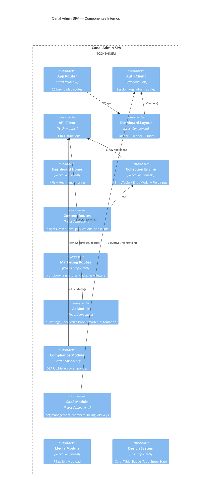

# C4 — Componentes (Nível 3) — Canal Admin SPA

```mermaid
C4Component
    title Canal Admin SPA — Componentes Internos

    Container_Boundary(spa, "Canal Admin SPA") {
        Component(router, "App Router", "React Router v7", "25 lazy-loaded routes")
        Component(auth_client, "Auth Client", "Better Auth SDK", "Session, org, admin, apiKey")
        Component(api_client, "API Client", "Fetch wrapper", "13 CRUD functions")

        Component(dashboard_layout, "Dashboard Layout", "React Component", "Sidebar + Header + Outlet")
        Component(dashboard_home, "Dashboard Home", "React Component", "KPIs + Health monitoring")
        Component(collection_engine, "Collection Engine", "React Components", "EntryTable + EntryModal + FieldInput")

        Component(content_routes, "Content Routes", "React Components", "insights, cases, jobs, publications, applicants")
        Component(marketing_routes, "Marketing Routes", "React Components", "brandbook, signatures, decks, newsletters")
        Component(ai_module, "AI Module", "React Components", "ai-settings, knowledge-base, AIWriter, automation")
        Component(compliance_module, "Compliance Module", "React Components", "DSAR, whistleblower, policies")
        Component(saas_module, "SaaS Module", "React Components", "org management, members, billing, API keys")
        Component(media_module, "Media Module", "React Component", "R2 gallery + upload")
        Component(design_system, "Design System", "UI Components", "Card, Table, Badge, Tabs, EmptyState")
    }

    Rel(router, dashboard_layout, "Wraps")
    Rel(dashboard_layout, auth_client, "useSession()")
    Rel(content_routes, collection_engine, "uses")
    Rel(collection_engine, api_client, "CRUD operations")
    Rel(ai_module, api_client, "generateWithAI()")
    Rel(compliance_module, api_client, "fetch DSAR/cases/policies")
    Rel(saas_module, auth_client, "useActiveOrganization()")
    Rel(media_module, api_client, "uploadMedia()")
```
