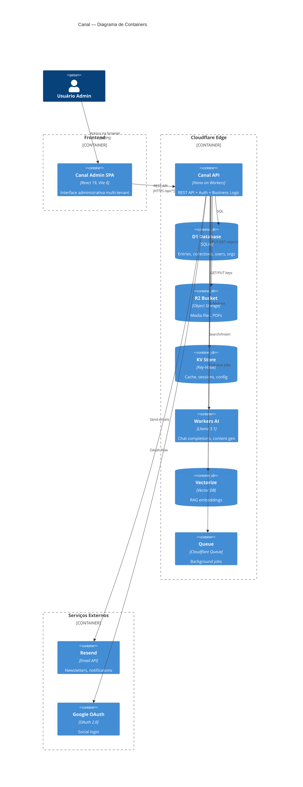

# C4 — Containers (Nível 2)

```mermaid
C4Container
    title Canal — Diagrama de Containers

    Person(user, "Usuário Admin")

    Container_Boundary(frontend, "Frontend") {
        Container(spa, "Canal Admin SPA", "React 19, Vite 6", "Interface administrativa multi-tenant")
    }

    Container_Boundary(edge, "Cloudflare Edge") {
        Container(worker, "Canal API", "Hono on Workers", "REST API + Auth + Business Logic")
        ContainerDb(d1, "D1 Database", "SQLite", "Entries, collections, users, orgs")
        ContainerDb(r2, "R2 Bucket", "Object Storage", "Media files, PDFs")
        ContainerDb(kv, "KV Store", "Key-Value", "Cache, sessions, config")
        Container(ai_worker, "Workers AI", "Llama 3.1", "Chat completions, content gen")
        ContainerDb(vectorize, "Vectorize", "Vector DB", "RAG embeddings")
        Container(queue, "Queue", "Cloudflare Queue", "Background jobs")
    }

    Container_Boundary(external, "Serviços Externos") {
        Container(resend, "Resend", "Email API", "Newsletters, notifications")
        Container(google, "Google OAuth", "OAuth 2.0", "Social login")
    }

    Rel(user, spa, "Acessa via browser", "HTTPS")
    Rel(spa, worker, "REST API", "HTTPS /api/*")
    Rel(worker, d1, "SQL")
    Rel(worker, r2, "PUT/GET objects")
    Rel(worker, kv, "GET/PUT keys")
    Rel(worker, ai_worker, "Inference")
    Rel(worker, vectorize, "Search/Insert")
    Rel(worker, queue, "Enqueue jobs")
    Rel(worker, resend, "Send emails")
    Rel(worker, google, "OAuth flow")
```
