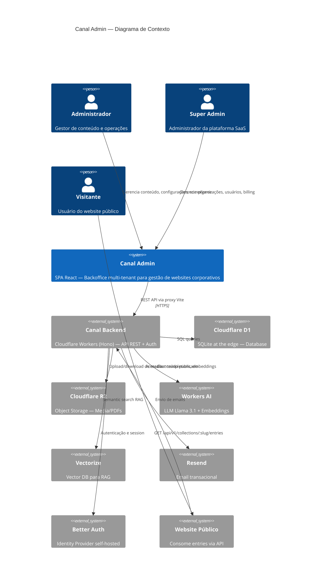

# C4 — Contexto (Nível 1)

```mermaid
C4Context
    title Canal Admin — Diagrama de Contexto

    Person(admin, "Administrador", "Gestor de conteúdo e operações")
    Person(superadmin, "Super Admin", "Administrador da plataforma SaaS")
    Person(visitor, "Visitante", "Usuário do website público")

    System(canal, "Canal Admin", "SPA React — Backoffice multi-tenant para gestão de websites corporativos")

    System_Ext(backend, "Canal Backend", "Cloudflare Workers (Hono) — API REST + Auth")
    System_Ext(d1, "Cloudflare D1", "SQLite at the edge — Database")
    System_Ext(r2, "Cloudflare R2", "Object Storage — Media/PDFs")
    System_Ext(ai, "Workers AI", "LLM Llama 3.1 + Embeddings")
    System_Ext(vectorize, "Vectorize", "Vector DB para RAG")
    System_Ext(resend, "Resend", "Email transacional")
    System_Ext(betterauth, "Better Auth", "Identity Provider self-hosted")
    System_Ext(website, "Website Público", "Consome entries via API")

    Rel(admin, canal, "Gerencia conteúdo, configurações, compliance")
    Rel(superadmin, canal, "Gerencia organizações, usuários, billing")
    Rel(canal, backend, "REST API via proxy Vite", "HTTPS")
    Rel(backend, d1, "SQL queries")
    Rel(backend, r2, "Upload/download de media")
    Rel(backend, ai, "Chat completions, embeddings")
    Rel(backend, vectorize, "Semantic search RAG")
    Rel(backend, resend, "Envio de emails")
    Rel(backend, betterauth, "Autenticação e session")
    Rel(website, backend, "GET /api/v1/collections/:slug/entries")
    Rel(visitor, website, "Acessa conteúdo publicado")
```
