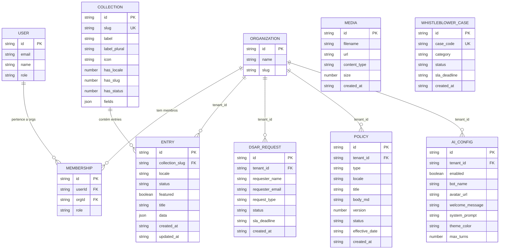

# ERD Completo — canal-admin (Frontend View)

> 🟡 INFERIDO — Entidades extraídas das interfaces TypeScript do frontend. Schema real no D1 pode diferir.

```mermaid
erDiagram
    ORGANIZATION {
        string id PK
        string name
        string slug
    }
    USER {
        string id PK
        string email
        string name
        string role
    }
    MEMBERSHIP {
        string id PK
        string userId FK
        string orgId FK
        string role
    }
    COLLECTION {
        string id PK
        string slug UK
        string label
        string label_plural
        string icon
        number has_locale
        number has_slug
        number has_status
        json fields
    }
    ENTRY {
        string id PK
        string collection_slug FK
        string locale
        string status
        boolean featured
        string title
        json data
        string created_at
        string updated_at
    }
    MEDIA {
        string id PK
        string filename
        string url
        string content_type
        number size
        string created_at
    }
    DSAR_REQUEST {
        string id PK
        string tenant_id FK
        string requester_name
        string requester_email
        string request_type
        string status
        string sla_deadline
        string created_at
    }
    WHISTLEBLOWER_CASE {
        string id PK
        string case_code UK
        string category
        string status
        string sla_deadline
        string created_at
    }
    POLICY {
        string id PK
        string tenant_id FK
        string type
        string locale
        string title
        string body_md
        number version
        string status
        string effective_date
        string created_at
    }
    AI_CONFIG {
        string id PK
        string tenant_id FK
        boolean enabled
        string bot_name
        string avatar_url
        string welcome_message
        string system_prompt
        string theme_color
        number max_turns
    }

    ORGANIZATION ||--o{ MEMBERSHIP : "tem membros"
    USER ||--o{ MEMBERSHIP : "pertence a orgs"
    COLLECTION ||--o{ ENTRY : "contém entries"
    ORGANIZATION ||--o{ ENTRY : "tenant_id"
    ORGANIZATION ||--o{ DSAR_REQUEST : "tenant_id"
    ORGANIZATION ||--o{ POLICY : "tenant_id"
    ORGANIZATION ||--o{ AI_CONFIG : "tenant_id"
```
