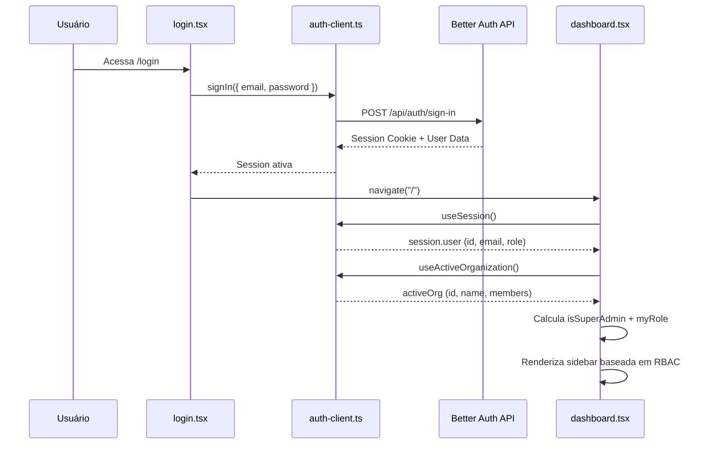
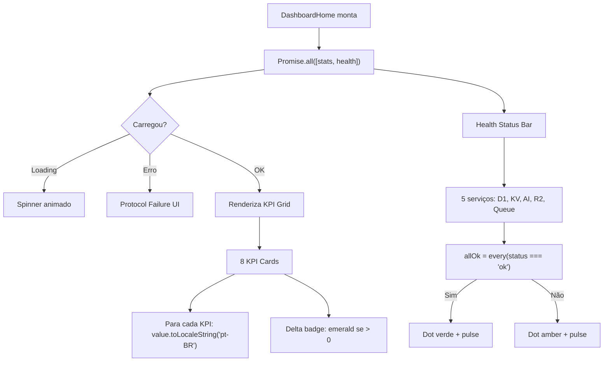
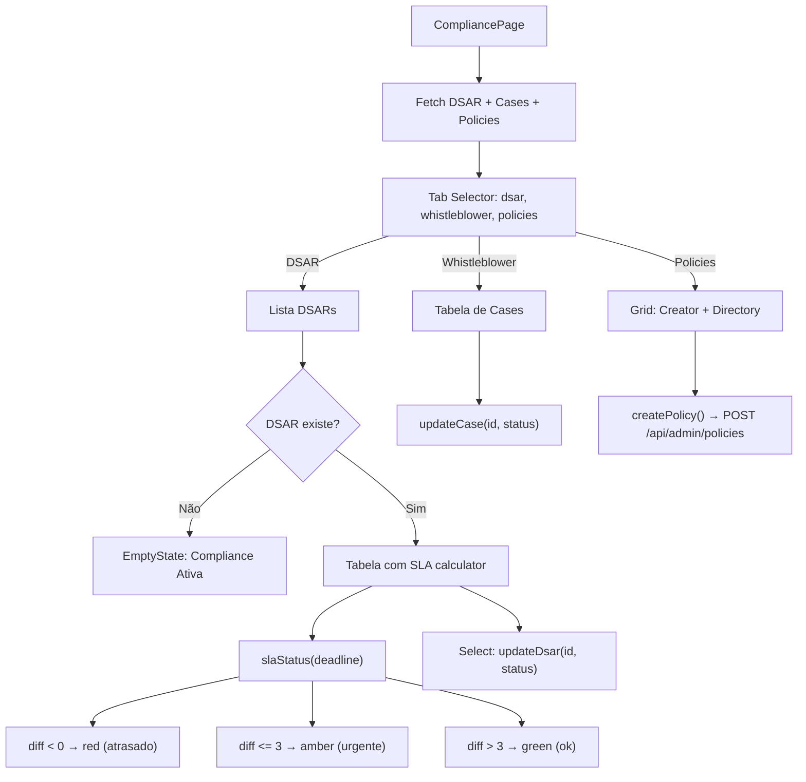
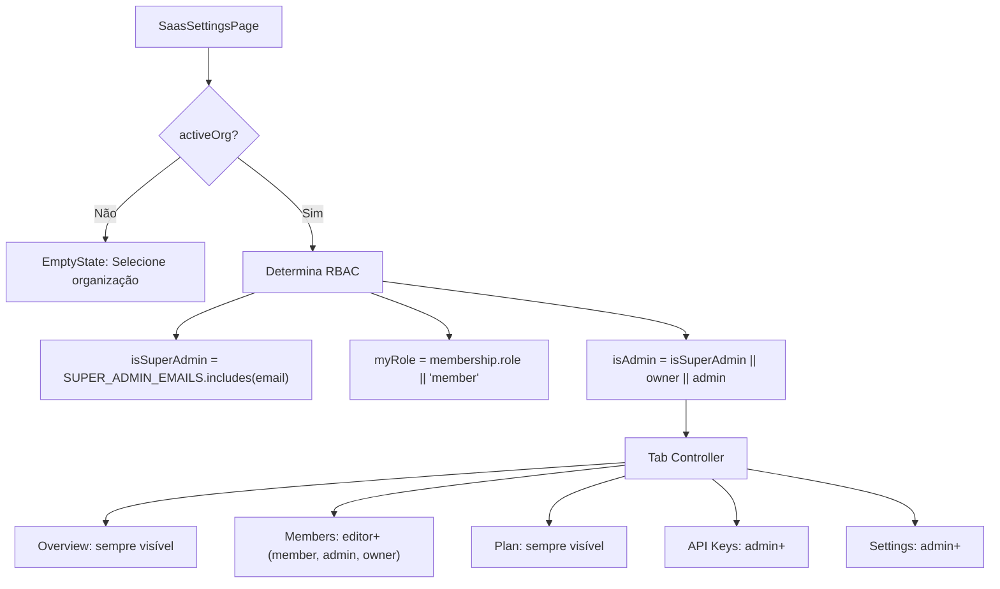
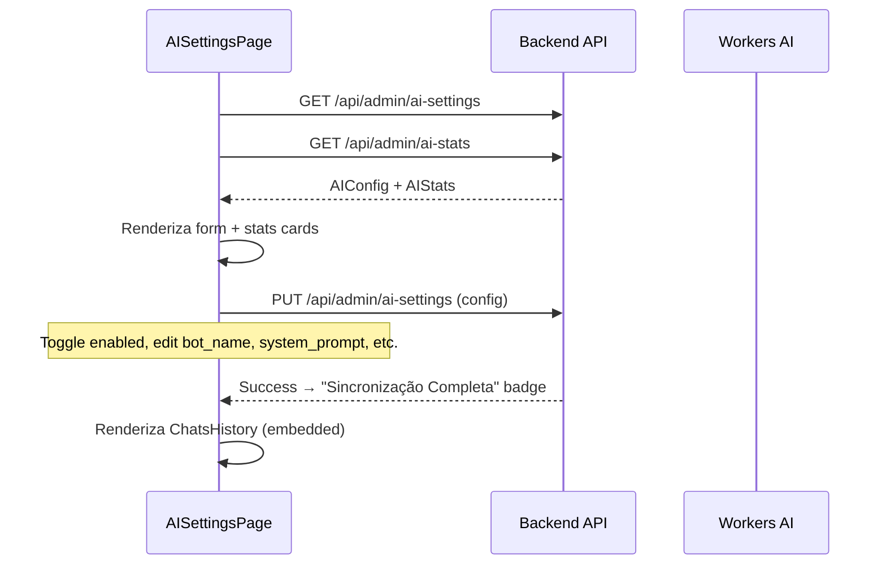

# Fluxograma: auth



# Fluxograma: collections

```mermaid
flowchart TD
    A["CollectionPage({ slug })"] --> B[fetchCollection]
    B --> C{collection existe?}
    C -->|Não| D[Loader spinner]
    C -->|Sim| E[fetchEntries com locale/page]
    E --> F[Renderiza EntryTable]

    F --> G{Ação do usuário}
    G -->|Criar| H[openCreate → defaults + locale]
    G -->|Editar| I[openEdit → form preenchido]
    G -->|Deletar| J[confirm() → deleteEntry]
    G -->|Status| K[toggleEntryStatus]
    G -->|Featured| L[toggleEntryFeatured]
    G -->|Paginar| M[setPage → reload]
    G -->|Locale| N[setLocale → reset page 1]

    H --> O[EntryModal mode=create]
    I --> O
    O --> P{Salvar?}
    P -->|Sim| Q[createEntry / updateEntry]
    Q --> R[closeModal → load()]
```

# Fluxograma: dashboard-home



# Fluxograma: compliance (DSAR)



# Fluxograma: saas



# Fluxograma: ai-settings


