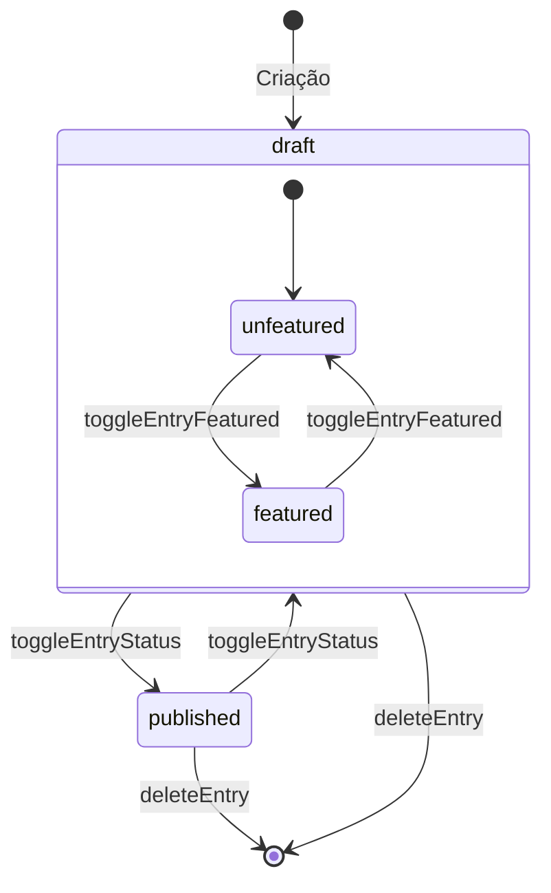
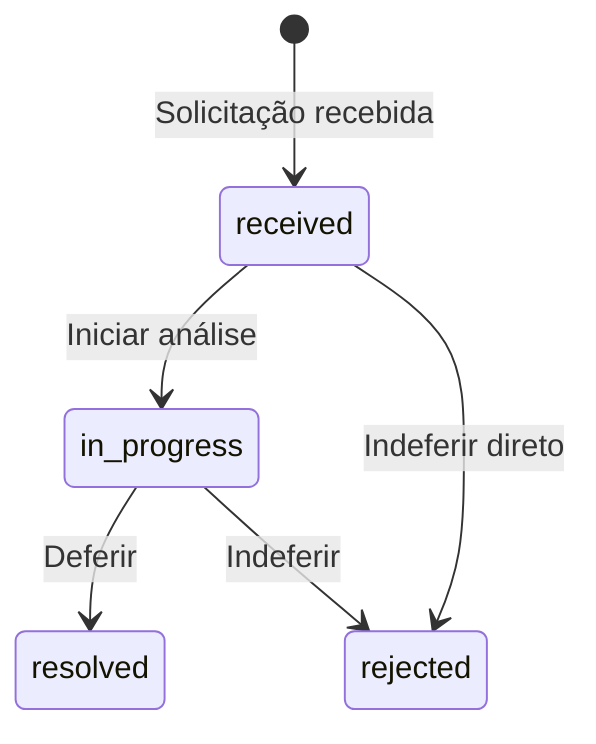
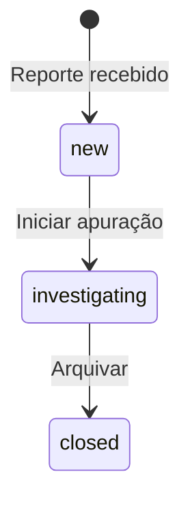
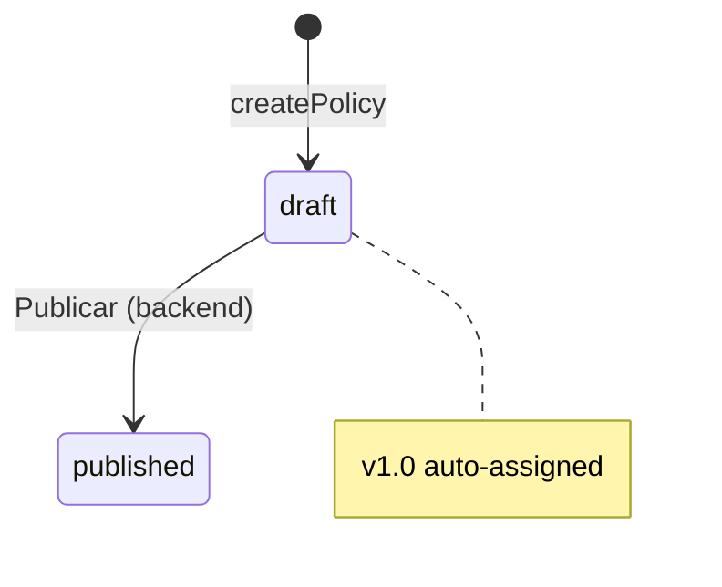
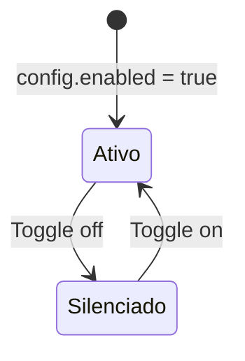

# Máquinas de Estado — canal-admin

> Gerado pelo Detetive em 2026-05-01

---

## Entry (Content Lifecycle)

**Confiança:** 🟢 CONFIRMADO — extraído de `api.ts` e `collection.tsx`

---

## DSAR Request

**Confiança:** 🟢 CONFIRMADO — extraído de `compliance.tsx:211-215`

---

## Whistleblower Case

**Confiança:** 🟢 CONFIRMADO — extraído de `compliance.tsx:298-301`

---

## Policy

**Confiança:** 🟡 INFERIDO — transição para `published` não visível no frontend

---

## AI Agent (Bot)

**Confiança:** 🟢 CONFIRMADO — extraído de `ai-settings.tsx:137`
