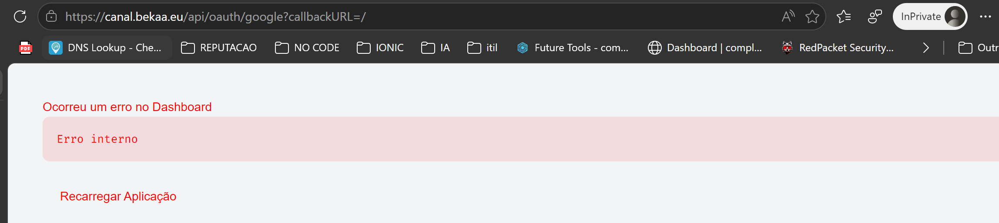
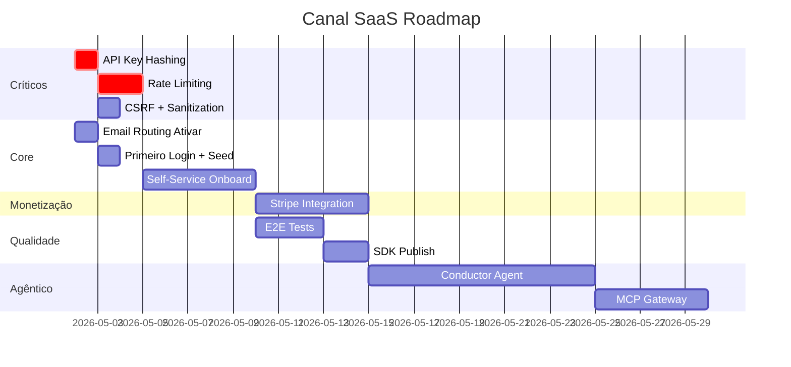

# 🗺️ Canal SaaS — Plano de Próximos Passos

> Débitos técnicos + evolução da plataforma, priorizados por impacto e risco.

---

## Estado Atual (Maio 2026)

| Métrica | Valor |
|---------|-------|
| Backend source files | 32 `.ts` |
| Admin frontend routes | 30 `.tsx` |
| Schema tables | 30 entidades |
| Migrations | 7 SQL files |
| Deploy | ✅ `canal.bekaa.eu` (Cloudflare Workers) |
| Auth | ✅ Better Auth + Google OAuth + API Keys + Agent Auth (MCP) |
| Email | ✅ Cloudflare Email Service (binding nativo) |
| Infra | D1 + KV + R2 + Vectorize + Queue + Analytics + Durable Objects |

---

## Sprint 1: Débitos Técnicos Críticos ✅ COMPLETO
**Impacto:** Segurança + estabilidade. Bloqueante para produção real.

### 1.1 API Key Hashing (SHA-256)
- **Problema:** API keys armazenadas em plaintext no D1 (`admin.ts` L100)
- **Risco:** Leak do banco expõe todas as keys de todos os tenants
- **Solução:**
  - Na criação: `key = SHA-256(rawKey)`, armazenar hash no D1
  - Na verificação: `resolveApiKeyOrSession` faz `SHA-256(bearerToken)` e busca pelo hash
  - Migration: hash de todas as keys existentes
- **Arquivos:** `src/routes/admin.ts`, `src/index.ts` (middleware)
- **Esforço:** Baixo (2-3h)

### 1.2 Rate Limiting por API Key / Plano
- **Problema:** Nenhum rate limiting implementado
- **Risco:** Um tenant pode DDoS toda a plataforma
- **Solução:**
  - Sliding window counter via KV: `rate:{apiKey}:{minute}` → count
  - Limites por plano: Free=20req/min, Starter=100, Pro=500, Enterprise=∞
  - Return `429 Too Many Requests` + `Retry-After` header
- **Arquivos:** Novo middleware `src/middleware/rate-limit.ts`, `src/index.ts`
- **Esforço:** Médio (4-6h)

### 1.3 CSRF Protection
- **Problema:** Nenhum CSRF token nas mutations
- **Risco:** Ataques cross-site em endpoints admin (criar/deletar entries)
- **Solução:** Better Auth já tem CSRF built-in para auth routes; adicionar `Origin` check no middleware para rotas admin/API
- **Arquivos:** `src/index.ts` (global middleware)
- **Esforço:** Baixo (1-2h)

### 1.4 Input Sanitization
- **Problema:** Entries content aceita HTML direto sem sanitização
- **Risco:** XSS stored via API
- **Solução:** Sanitizar HTML no `POST/PUT /api/v1/entries` com DOMPurify ou regex simples
- **Arquivos:** `src/routes/entries.ts`
- **Esforço:** Baixo (2h)

---

## Sprint 2: Email Routing (Ativar) + Primeiro Login ✅ COMPLETO
**Impacto:** Funcionalidade core. Desbloqueia onboarding real.

### 2.1 Ativar Cloudflare Email Routing (subdomínio)
- **Ação manual:** Dashboard Cloudflare → Email → Enable para `canal.bekaa.eu`
- **Resultado:** `SEND_EMAIL` binding funcional em prod

### 2.2 Primeiro Login + Seed Data
- Login com Google (`@bekaa.eu`) → valida auto-admin
- Criar organização NESS via API/admin
- Seed collections base (insights, cases, jobs)
- Verificar welcome email

### 2.3 Testar Fluxo Completo
- Criar API Key no admin → usar em cURL contra `/api/v1/entries`
- Verificar CORS dinâmico com domínio registrado
- Testar widget em página externa

---

## Sprint 3: Self-Service Onboarding ✅ COMPLETO
**Impacto:** Transforma o Canal de "CMS interno" em "SaaS para clientes".

### 3.1 Onboarding Wizard (Backend)
- `POST /api/onboarding/signup` — cria user + org + seed collections + 1ª API key
- Validação de domínio único por tenant
- Rate limit no signup (anti-abuse)
- **Arquivos:** `src/routes/onboarding.ts` (já existe parcialmente)

### 3.2 Onboarding Wizard (Frontend)
- Wizard de 4 steps: Nome/Email → Nome da Org → Config do Chatbot → API Key
- Já existe `onboarding-wizard.tsx` — conectar ao backend real
- **Arquivos:** `admin/src/routes/onboarding-wizard.tsx`

### 3.3 Planos e Limites
- Tabela `plans` com limites definidos (entries, API calls, storage)
- Middleware de enforcement: verificar limites antes de write operations
- UI de "Usage" no dashboard mostrando consumo vs. limite
- **Arquivos:** Schema migration + novo middleware + admin UI

---

## Sprint 4: Billing Real (Stripe) ✅ IMPLEMENTADO (aguardando secrets)
**Impacto:** Monetização. Pode esperar até ter tenants.

### 4.1 Stripe Checkout + Webhooks
- `saas-onboarding.ts` já tem estrutura com REST API direta (sem SDK, Workers-compatible)
- Falta: `STRIPE_SECRET_KEY` + `STRIPE_WEBHOOK_SECRET` secrets
- Implementar: checkout session → webhook → update org plan
- **Status:** Código parcialmente escrito, falta credenciais e teste real

### 4.2 Customer Portal
- Stripe Customer Portal para self-service billing
- Cancel / upgrade / update payment method
- Link acessível via admin panel

### 4.3 Usage Metering
- Analytics Engine binding já existe (`ANALYTICS`)
- Telemetry middleware já conta requests
- Falta: reportar ao Stripe como metered billing

---

## Sprint 5: Testes E2E + SDK Publish 🟢
**Impacto:** Qualidade e distribuição.

### 5.1 Playwright E2E
- `e2e/api-v1.spec.ts` já existe (estrutura)
- Adicionar: auth flow, CRUD entries, API key lifecycle, CORS, widget
- CI/CD: GitHub Actions com Wrangler para staging

### 5.2 SDK `@canal/sdk` Publish
- `sdk/` tem 7 arquivos, `tsup` configurado
- `npm install` + `npm run build` + publicar no npm
- Documentar no Developer Portal

### 5.3 Widget E2E
- Testar `<canal-chat>` em página HTML estática
- Verificar multi-tenant isolation via widget

---

## Sprint 6: Evolução Agêntica 🟣
**Impacto:** Diferencial competitivo. O "Plano D" do brainstorm.

### 6.1 Conductor Agent
- Evoluir `GabiAgent` (Durable Object) para orquestrador multi-skill
- Skills: content analysis, auto-categorization, smart summaries
- Integrar com Cloudflare AI (binding `AI` já configurado)

### 6.2 Email Bidirecional
- Agentes que recebem e respondem emails
- Durable Objects mantêm estado da conversa
- Cloudflare Email Routing (inbound) + Email Sending (outbound)

### 6.3 MCP Agent Gateway
- Expandir capabilities do Agent Auth
- Consent screen para aprovar capabilities
- Audit log de ações dos agentes
- Rate limiting específico para agentes

### 6.4 Webhooks
- Notificar sistemas externos sobre eventos (new entry, org created, etc.)
- Queue-based delivery com retry
- UI de gestão de webhooks no admin

---

## Cronograma Sugerido

---

## Prioridade de Execução

| # | Item | Sprint | Risco se Ignorar |
|---|------|--------|-----------------|
| 1 | API Key Hashing | S1 | 🔴 Vazamento de keys |
| 2 | Rate Limiting | S1 | 🔴 DDoS por tenant |
| 3 | Email Routing (ativar) | S2 | 🟡 Sem emails transacionais |
| 4 | Primeiro Login + Seed | S2 | 🟡 Plataforma vazia |
| 5 | CSRF + Sanitization | S1 | 🟡 XSS/CSRF attacks |
| 6 | Self-Service Onboarding | S3 | 🟢 Não escala sem isso |
| 7 | Stripe Billing | S4 | 🟢 Sem receita |
| 8 | E2E Tests | S5 | 🟢 Regressions |
| 9 | Agentes (Conductor) | S6 | 🟢 Diferencial futuro |

---

> [!IMPORTANT]
> **Sprint 1 (Segurança)** deve ser feita ANTES de qualquer cliente externo acessar a plataforma.
> As keys em plaintext no D1 são o risco #1 do sistema.

> [!TIP]
> **Sprint 2 pode rodar em paralelo** com Sprint 1 — são ações manuais (dashboard) + validação.
