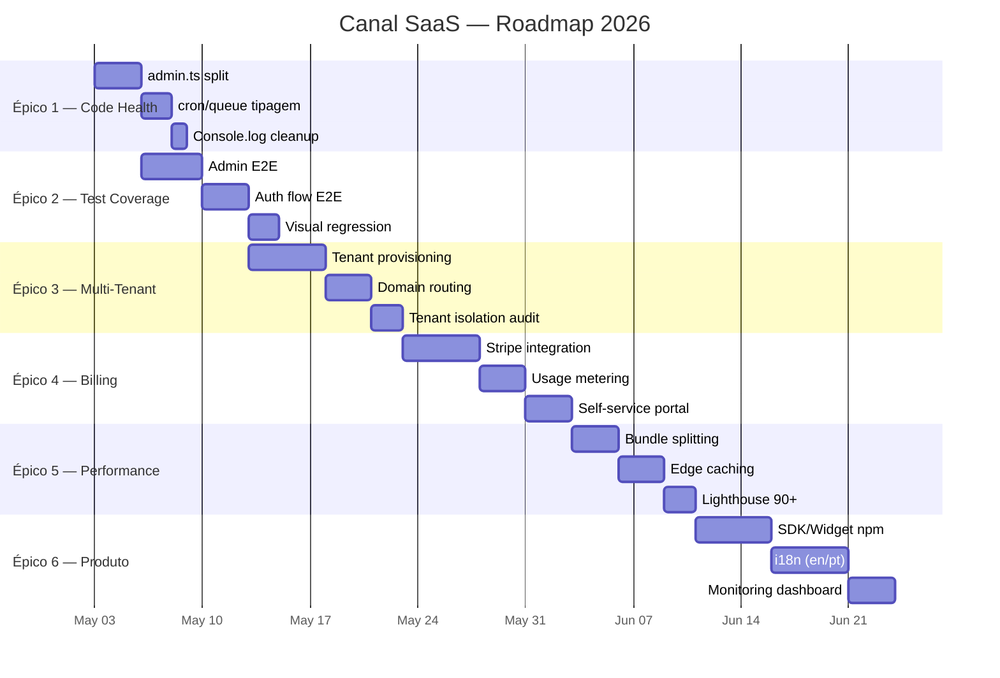

# 🗺️ Canal SaaS — Roadmap de Próximos Passos

> **Gerado em:** 2026-05-02  
> **Estado atual:** Produção estável (`canal.bekaa.eu`), 44 arquivos backend, 80 frontend, 30 rotas admin, E2E 9/9  
> **Última sprint:** Tech debt eliminado (Zod 34/34, any 48→1, index.ts 957→479)

---

## Visão Geral dos Épicos



---

## Épico 1 — Code Health (Finalização Estrutural)

**Objetivo:** Eliminar os últimos god-files e tipagem fraca nos workers auxiliares.  
**Estimativa:** 6 dias | **Risco:** Médio (toca CRUD core)

### 1.1 — Split `admin.ts` (896 linhas → módulos)

O maior arquivo restante. Contém CRUD de leads, collections, org management, analytics export.

| Módulo Proposto | Linhas | Conteúdo |
|---|---|---|
| `routes/admin/leads.ts` | ~200 | CRUD leads, CSV export |
| `routes/admin/collections.ts` | ~150 | Collection CRUD, field management |
| `routes/admin/organizations.ts` | ~150 | Org CRUD, plan updates, member mgmt |
| `routes/admin/analytics.ts` | ~100 | Chat sessions, CSAT export, KPIs |
| `routes/admin/settings.ts` | ~100 | API keys, chatbot config, domains |
| `routes/admin/index.ts` | ~50 | Mount point (re-exports) |

**Tarefas:**
- [ ] Mapear todas as rotas `admin.get/post/put/delete` por domínio
- [ ] Criar 5 sub-módulos com Hono sub-routers
- [ ] Criar `routes/admin/index.ts` como re-exportador
- [ ] Atualizar `index.ts` para montar `admin` como roteador composto
- [ ] Verificar que nenhum import circular foi criado
- [ ] E2E: 9/9 passando

### 1.2 — Tipagem `cron.ts` / `queue.ts` / `mcp.ts`

Esses 3 arquivos concentram ~80% dos `any` restantes.

| Arquivo | `any` count | Ação |
|---|---|---|
| `cron.ts` | 5 | Criar `CronEnv` type que extends `Bindings` |
| `queue.ts` | 7 | Criar `QueueMessage` discriminated union (process-resume, send-email, etc) |
| `mcp.ts` | 3 | Tipar `__MCP_ENV` e parâmetros de ferramentas |
| `agent.ts` | 2 | Tipar `messages` array como `ChatMessage[]` |
| `auth.ts` | 3 | Remover `any` dos email bindings |
| `email.ts` | 3 | Usar `SendEmailBinding` de `types/bindings.ts` |

**Tarefas:**
- [ ] Criar `src/types/queue.ts` com `QueueMessage` union
- [ ] Criar `src/types/cron.ts` com `CronEnv`
- [ ] Atualizar `cron.ts` — 0 `any`
- [ ] Atualizar `queue.ts` — 0 `any`
- [ ] Atualizar `mcp.ts` — 0 `any`
- [ ] Atualizar `agent.ts` — 0 `any`
- [ ] Atualizar `auth.ts` e `email.ts` — usar tipos de `bindings.ts`
- [ ] Build + Deploy + E2E verde

### 1.3 — Cleanup final

- [ ] Remover `console.log` comentados (grep `// console`)
- [ ] Remover imports não utilizados (`grep -rn 'import.*from' | ...`)
- [ ] Verificar que `src/types.ts` (antigo) pode ser removido se vazio
- [ ] Atualizar `CODEBASE.md` / `ARCHITECTURE.md` com nova estrutura

---

## Épico 2 — Test Coverage (Rede de Segurança)

**Objetivo:** De 9 testes para 40+, cobrindo admin, auth e visual.  
**Estimativa:** 9 dias | **Risco:** Baixo  
**Pré-requisito:** Épico 1 completo (para não refatorar testes)

### 2.1 — Admin API E2E (Playwright)

Atualmente zero cobertura nas rotas `/api/admin/*`.

**Testes a criar (`e2e/admin.spec.ts`):**
- [ ] `GET /api/admin/dashboard-stats` — retorna KPIs
- [ ] `GET /api/admin/leads` — lista leads
- [ ] `POST /api/admin/leads` — cria lead (validação Zod)
- [ ] `PUT /api/admin/leads/:id` — atualiza lead
- [ ] `DELETE /api/admin/leads/:id` — remove lead
- [ ] `GET /api/admin/collections` — lista collections
- [ ] `GET /api/admin/organizations` — lista orgs (requer superadmin)
- [ ] `PATCH /api/admin/organizations/:id` — atualiza plano
- [ ] `GET /api/admin/api-keys` — lista chaves
- [ ] `POST /api/admin/api-keys` — gera chave (confirma hash)
- [ ] `DELETE /api/admin/api-keys/:id` — revoga chave
- [ ] `GET /api/admin/newsletter-subscribers` — lista subs
- [ ] `POST /api/admin/newsletters/send` — envia newsletter (mock)
- [ ] `GET /api/admin/chatbot-config` — retorna config
- [ ] `PUT /api/admin/chatbot-config` — atualiza config

**Infraestrutura:**
- [ ] Criar `e2e/helpers/auth.ts` — helper para obter session cookie
- [ ] Criar `e2e/helpers/seed.ts` — seed de dados de teste
- [ ] Configurar `playwright.config.ts` com `baseURL` e `storageState`

### 2.2 — Auth Flow E2E

- [ ] `POST /api/auth/sign-up/email` — registro com email/senha
- [ ] `POST /api/auth/sign-in/email` — login com email/senha
- [ ] `GET /api/auth/session` — retorna sessão ativa
- [ ] `POST /api/auth/sign-out` — logout
- [ ] `GET /api/oauth/google` — redirect 302 com state + cookie
- [ ] `GET /api/auth/callback/google` — callback com state (mock)
- [ ] Testar RBAC: user normal **não** pode acessar `/api/admin/*`
- [ ] Testar RBAC: admin **pode** acessar `/api/admin/*`
- [ ] Testar API Key: `Bearer pk_xxx` resolve tenant corretamente
- [ ] Testar rate limit: 21ª request retorna 429

### 2.3 — Visual Regression (Playwright Screenshots)

- [ ] Login page — screenshot baseline
- [ ] Dashboard home — screenshot baseline
- [ ] Content editor — screenshot baseline
- [ ] Brand hub — screenshot baseline
- [ ] Compliance module — screenshot baseline
- [ ] Configurar `toHaveScreenshot()` com `maxDiffPixels: 100`

### 2.4 — Compliance E2E

- [ ] `POST /api/compliance/dsar` — cria requisição DSAR
- [ ] `GET /api/compliance/dsar?tenant_id=xxx` — lista DSARs
- [ ] `POST /api/compliance/whistleblower` — denúncia anônima
- [ ] `POST /api/compliance/consent-log` — registra consentimento
- [ ] `GET /api/compliance/policies?tenant_id=xxx` — lista políticas

---

## Épico 3 — Multi-Tenant Real

**Objetivo:** De `DEFAULT_TENANT_ID` fallback → provisionamento self-service completo.  
**Estimativa:** 10 dias | **Risco:** Alto (core architecture)  
**Pré-requisito:** Épico 2 (rede de segurança)

### 3.1 — Tenant Provisioning Automático

Hoje o onboarding cria org via Better Auth mas não configura tenant_domains nem chatbot_config.

**Tarefas:**
- [ ] `POST /api/onboarding/complete` → após criar org:
  - [ ] INSERT `tenant_domains` com domínio padrão (`{slug}.canal.bekaa.eu`)
  - [ ] INSERT `chatbot_config` com defaults (bot_name, theme, welcome_message)
  - [ ] INSERT `collections` seed (insights, pages, cases padrão)
  - [ ] INSERT `brand_settings` com defaults
- [ ] Criar tabela `tenant_settings` (timezone, currency, locale, custom_domain)
- [ ] Migration D1 para `tenant_settings`
- [ ] Atualizar onboarding wizard frontend para coletar timezone/locale

### 3.2 — Domain Routing Dinâmico

O CORS já valida `tenant_domains` no D1 — falta o roteamento inverso.

**Tarefas:**
- [ ] Middleware `resolveTenantByDomain` — extrai tenant do `Host` header
- [ ] Suportar wildcard subdomain: `*.canal.bekaa.eu` → resolve slug
- [ ] Suportar custom domain: `cms.cliente.com` → resolve via `tenant_domains`
- [ ] Adicionar `X-Tenant-Id` header a todas as respostas
- [ ] Admin UI: página de "Domínios" com verificação DNS (TXT record)
- [ ] DNS verification worker: cron job verifica registros TXT pendentes

### 3.3 — Tenant Isolation Audit

- [ ] Verificar que TODA query D1 filtra por `tenant_id` ou `organization.id`
- [ ] Grep de queries sem WHERE tenant: `grep -rn 'SELECT.*FROM.*WHERE' | grep -v tenant`
- [ ] Testar IDOR: tenant A **não** pode acessar dados de tenant B
- [ ] Testar que API keys de tenant A retornam 401 para dados de tenant B
- [ ] Documentar: `SECURITY.md` — tenant isolation model

### 3.4 — Plano Free com Limites

- [ ] Definir limites por plano:
  | Recurso | Free | Pro | Enterprise |
  |---|---|---|---|
  | Entries | 100 | 5.000 | Ilimitado |
  | Media storage | 100MB | 5GB | 50GB |
  | API calls/min | 20 | 100 | Ilimitado |
  | Members | 2 | 10 | Ilimitado |
  | Collections | 5 | 20 | Ilimitado |
  | Knowledge base docs | 3 | 50 | Ilimitado |
- [ ] Middleware `enforcePlanLimits` — antes de writes, verifica quota
- [ ] Frontend: banner de upgrade quando limite atingido
- [ ] KV cache para contagem de uso (evitar queries a cada request)

---

## Épico 4 — Billing & Monetização

**Objetivo:** Integração Stripe completa para self-service billing.  
**Estimativa:** 11 dias | **Risco:** Alto (dinheiro real)  
**Pré-requisito:** Épico 3 (multi-tenant)

### 4.1 — Stripe Checkout Integration

Endpoints de billing existem em `saas-onboarding.ts` mas usam `STRIPE_SECRET_KEY` sem binding tipado.

**Tarefas:**
- [ ] Adicionar `STRIPE_SECRET_KEY` e `STRIPE_WEBHOOK_SECRET` ao `Bindings` type
- [ ] Adicionar ao `wrangler.jsonc` como secrets
- [ ] Criar `src/billing/stripe.ts` — client wrapper tipado
- [ ] Implementar `POST /api/saas/checkout` — Stripe Checkout Session
- [ ] Implementar `POST /api/saas/portal` — Stripe Billing Portal redirect
- [ ] Implementar `POST /api/saas/webhooks` — Stripe webhook handler:
  - [ ] `checkout.session.completed` → ativa plano
  - [ ] `customer.subscription.updated` → atualiza plano
  - [ ] `customer.subscription.deleted` → downgrade para free
  - [ ] `invoice.payment_failed` → notifica admin + grace period
- [ ] Verificação de assinatura: idempotent, com retry
- [ ] Testes: mock Stripe webhook com payloads reais

### 4.2 — Usage Metering

- [ ] Cron job semanal: calcula uso por tenant (entries, media, API calls)
- [ ] Armazena em `tenant_usage` table
- [ ] Dashboard admin: gráfico de uso vs. limite
- [ ] Email automático quando atingir 80% do limite
- [ ] Email automático quando atingir 100% (soft block)

### 4.3 — Self-Service Portal (Admin UI)

- [ ] Página `/billing` no admin:
  - [ ] Plano atual + próxima cobrança
  - [ ] Botão "Gerenciar Assinatura" → Stripe Portal
  - [ ] Histórico de faturas
  - [ ] Uso atual vs. limites (barras de progresso)
- [ ] Página `/billing/upgrade`:
  - [ ] Comparativo de planos (Free/Pro/Enterprise)
  - [ ] CTA de upgrade → Stripe Checkout
- [ ] Notificação toast quando trial expira

---

## Épico 5 — Performance & Edge

**Objetivo:** Lighthouse 90+, bundle splitting, edge caching.  
**Estimativa:** 8 dias | **Risco:** Baixo

### 5.1 — Bundle Splitting

O `index.js` do admin tem **292KB gzip** — muito pesado para first load.

**Tarefas:**
- [ ] Análise com `npx vite-bundle-visualizer`
- [ ] Verificar: `react-dom` (130KB) está sendo tree-shaken?
- [ ] Lazy load routes pesadas: compliance, intelligence, automation
- [ ] Separar `auth-client` como chunk independente
- [ ] Objetivo: `index.js` < 150KB gzip, LCP < 2s

### 5.2 — Edge Caching (Cloudflare)

- [ ] Configurar `Cache-Control` em rotas públicas:
  | Rota | Cache | TTL |
  |---|---|---|
  | `GET /api/v1/entries/:slug` | CDN | 5min |
  | `GET /api/chatbot-config` | CDN | 60s (já tem) |
  | `GET /api/content/*` | CDN | 5min |
  | `GET /api/compliance/policies` | CDN | 1h |
  | `GET /api/og` | CDN | Immutable (já tem) |
  | `GET /media/*` | CDN | Immutable (já tem) |
- [ ] Implementar cache invalidation via `purgeCache` no POST/PUT/DELETE
- [ ] Substituir `seucdn.com` placeholder em `/media/:filename` por R2 public URL real
- [ ] Configurar R2 custom domain: `media.canal.bekaa.eu`

### 5.3 — Lighthouse Audit

- [ ] Rodar Lighthouse CI no login page
- [ ] Rodar Lighthouse CI no dashboard
- [ ] Corrigir: fonts FOUT (preload Google Fonts)
- [ ] Corrigir: CLS de lazy-loaded routes
- [ ] Objetivo: Performance 90+, Accessibility 95+, Best Practices 100

---

## Épico 6 — Produto & Crescimento

**Objetivo:** SDK público, i18n, monitoring.  
**Estimativa:** 13 dias | **Risco:** Médio

### 6.1 — SDK/Widget NPM Package

O widget chatbot (`widget.ts`, 195 linhas) é injetável mas não é empacotado.

**Tarefas:**
- [ ] Criar `packages/canal-widget/` com `package.json`
- [ ] Build como UMD + ESM: `<script src="https://cdn.canal.bekaa.eu/widget.js">`
- [ ] API pública: `CanalWidget.init({ tenantId, position, theme })`
- [ ] Documentar: `README.md` com exemplos de integração
- [ ] Publicar no npm: `@canal-saas/widget`
- [ ] Versionar: semver
- [ ] Criar landing page em `/developer-portal` com código de integração

### 6.2 — Internacionalização (i18n)

51 referências a locale no frontend, mas strings hardcoded em PT-BR.

**Tarefas:**
- [ ] Instalar `react-intl` ou `i18next`
- [ ] Extrair ~200 strings hardcoded do admin
- [ ] Criar `admin/src/locales/pt-BR.json`
- [ ] Criar `admin/src/locales/en.json`
- [ ] Criar seletor de idioma no header do dashboard
- [ ] Backend: aceitar `Accept-Language` header para mensagens de erro
- [ ] Widget: suportar `locale` no init
- [ ] Documentar idiomas suportados

### 6.3 — Monitoring & Alerting Dashboard

O Analytics Engine já grava telemetria (3 write points) mas não há visualização.

**Tarefas:**
- [ ] Criar rota admin `/intelligence/monitoring`:
  - [ ] Requests/min por tenant (gráfico de linha)
  - [ ] Latência P50/P95/P99 (gráfico de barras)
  - [ ] Erros 4xx/5xx por rota (tabela)
  - [ ] Top 10 rotas mais lentas
- [ ] Configurar alertas via Slack webhook:
  - [ ] P99 > 5s por 5 minutos
  - [ ] Error rate > 5% por 10 minutos
  - [ ] Uso de KV/D1 acima de 80% do limite free
- [ ] Cron job: digest semanal com métricas por email

### 6.4 — RBAC Granular

Hoje: `admin` vs `member`. Falta granularidade.

**Tarefas:**
- [ ] Definir roles: `owner`, `admin`, `editor`, `viewer`
- [ ] Definir permissões por collection:
  | Ação | Owner | Admin | Editor | Viewer |
  |---|---|---|---|---|
  | Criar entries | ✅ | ✅ | ✅ | ❌ |
  | Editar entries | ✅ | ✅ | ✅ (próprios) | ❌ |
  | Deletar entries | ✅ | ✅ | ❌ | ❌ |
  | Gerenciar members | ✅ | ✅ | ❌ | ❌ |
  | Gerenciar billing | ✅ | ❌ | ❌ | ❌ |
  | Ver analytics | ✅ | ✅ | ✅ | ✅ |
- [ ] Middleware `requireRole('admin', 'editor')` — composable
- [ ] Admin UI: página de convite com seletor de role
- [ ] Audit log: quem fez o quê (tabela `audit_log`)

---

## Verificação Final (Cross-Epic)

| Check | Objetivo |
|---|---|
| E2E suite | 40+ testes passando |
| Lighthouse | Performance 90+ |
| Bundle | index.js < 150KB gzip |
| `any` count | 0 em toda a codebase |
| `alert()` count | 0 |
| Security scan | OWASP Top 10 coberto |
| IDOR test | Tenant isolation confirmada |
| Stripe test | Webhook handler idempotent |
| i18n | 2 idiomas completos |
| SDK | npm package publicado |

---

## Prioridade de Execução Recomendada

```
Épico 1 (Code Health) → Épico 2 (Tests) → Épico 3 (Multi-Tenant)
                                          → Épico 5 (Performance)
                          Épico 4 (Billing) → Épico 6 (Produto)
```

> **Crítico:** Épicos 3 e 4 são os que desbloqueiam receita. Épicos 1 e 2 são pré-requisitos de segurança. Épicos 5 e 6 são polish.
